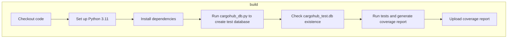

```mermaid
graph TD
    A[Checkout code] --> B[Set up Python 3.11]
    B --> C[Install dependencies]
    C --> D[Run cargohub_db.py to create test database]
    D --> E[Check cargohub_test.db existence]
    E --> F[Run tests and generate coverage report]
    F --> G[Upload coverage report]

    subgraph build
        A[Checkout code]
        B[Set up Python 3.11]
        C[Install dependencies]
        D[Run cargohub_db.py to create test database]
        E[Check cargohub_test.db existence]
        F[Run tests and generate coverage report]
        G[Upload coverage report]
    end
```