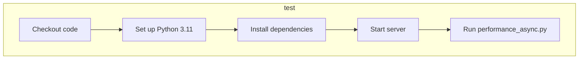

```mermaid
graph TD
    A[Checkout code] --> B[Set up Python 3.11]
    B --> C[Install dependencies]
    C --> D[Start server]
    D --> E[Run performance_async.py]

    subgraph test
        A[Checkout code]
        B[Set up Python 3.11]
        C[Install dependencies]
        D[Start server]
        E[Run performance_async.py]
    end
```