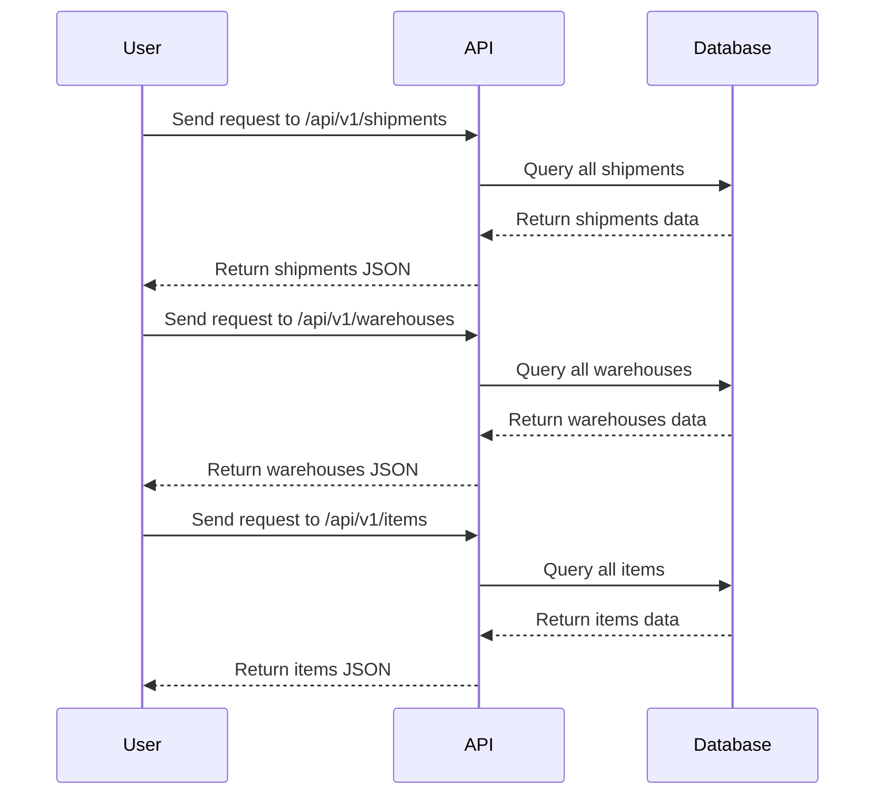

```mermaid
sequenceDiagram
    participant User
    participant API
    participant Database

    User->>API: Send request to /api/v1/shipments
    API->>Database: Query all shipments
    Database-->>API: Return shipments data
    API-->>User: Return shipments JSON

    User->>API: Send request to /api/v1/warehouses
    API->>Database: Query all warehouses
    Database-->>API: Return warehouses data
    API-->>User: Return warehouses JSON

    User->>API: Send request to /api/v1/items
    API->>Database: Query all items
    Database-->>API: Return items data
    API-->>User: Return items JSON
```